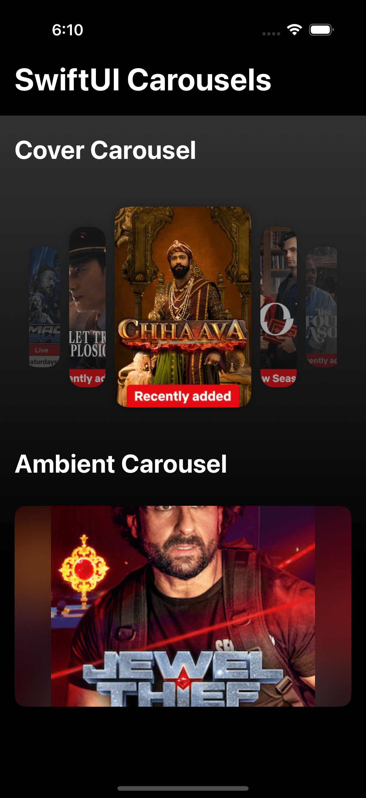
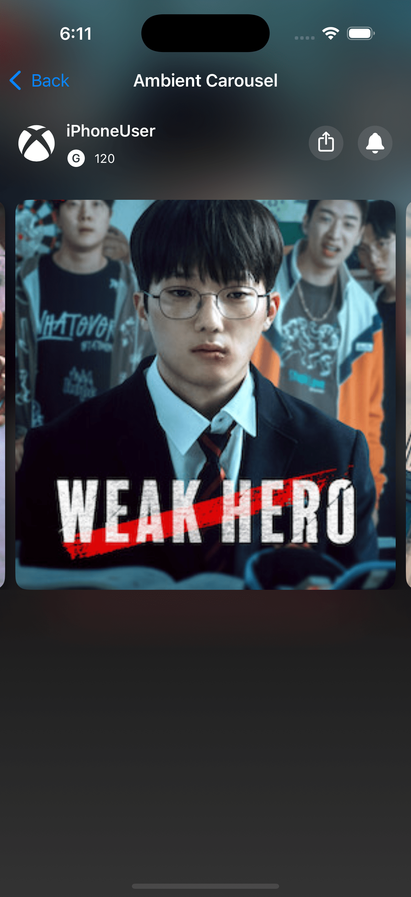
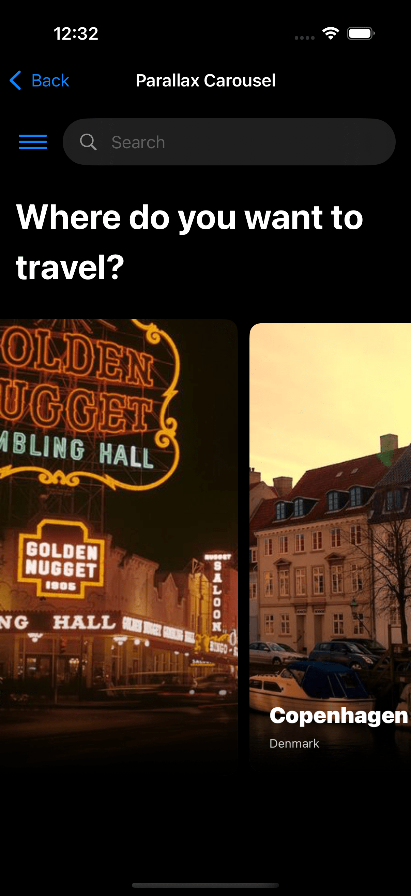
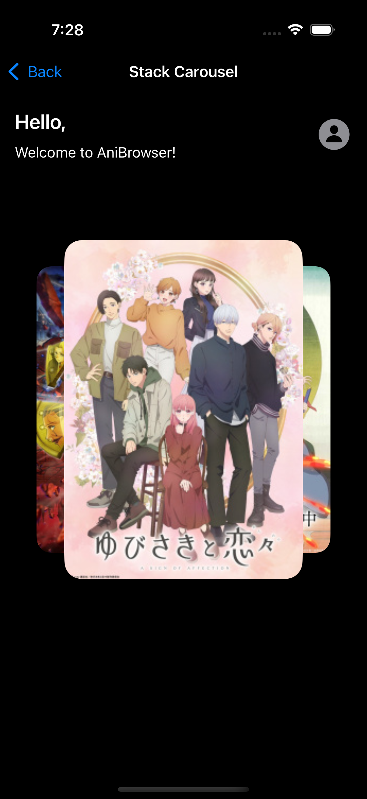

# 🎠 SwiftUICarousels

A curated collection of beautifully crafted **SwiftUI carousel layouts** — all in a single project. Designed to showcase advanced layout techniques and seamless transitions using pure SwiftUI.

---

## 📑 Table of Contents

- [📸 Previews](#-previews)
- [🚀 Getting Started](#-getting-started)
  - [⚙️ Prerequisites](#️-prerequisites)
  - [📥 Check it out yourself](#-check-it-out-yourself)
- [✨ Features](#-features)
- [🙏 Acknowledgements](#-acknowledgements)

---

## 📸 Previews

<p align="left">
  
  
  
  
  
</p>

---

## 🚀 Getting Started

### ⚙️ Prerequisites

- Xcode (latest version recommended)
- Swift
- SwiftUI

### 📦 Dependencies

- [`Kingfisher`](https://github.com/onevcat/Kingfisher) (via Swift Package Manager)

### 📥 Check it out yourself

Step-by-step guide on how to install and set up the project.

1. Clone the repository:

   ```bash
   git clone https://github.com/Aakarsh-verma/SwiftUICarousels.git
   ```

2. Navigate to the project directory within terminal

   ```bash
   cd path/to/SwiftUICarousels
   ```

4. Open `SwiftUICarousels.xcodeproj` in **xcode** and run the project

---

## ✨ Features

### 🎨 UI Highlights

- Smooth opacity and scale-based animations
- Dynamic ambient background carousel
- Parallax effect carousel with offset motion
- Stacked card carousel using zIndex and scaling
- Reusable architecture with custom SwiftUI transitions

### 🛠 Functional Highlights

- Clean MVVM architecture
- Generic `APIService` and `APIRouter`
- Protocol-oriented and enum-based navigation
- Modular widget plotting logic
- SPM-based dependency management

---

## 🙏 Acknowledgements

Inspired by the amazing work of [**@KavSoft**](https://www.youtube.com/@Kavsoft/videos).  
Check out their content for more SwiftUI ideas and inspiration.

---

> ⭐ Found this project useful? Consider starring the repo or sharing it with fellow iOS developers!
